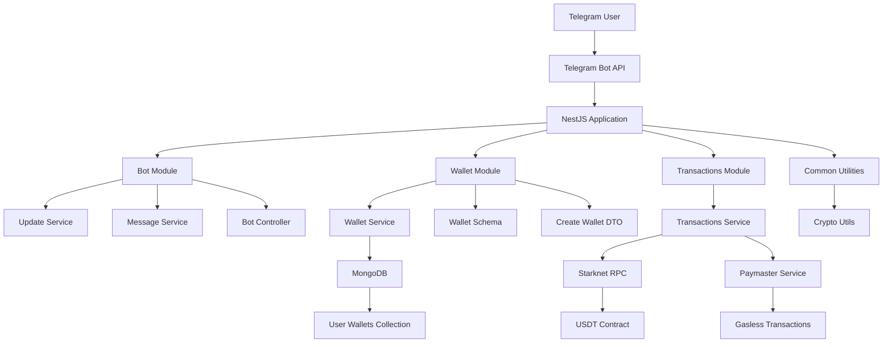
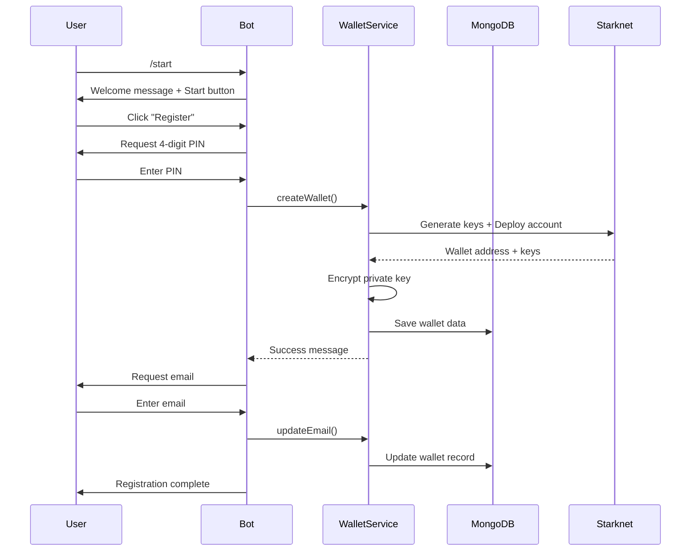
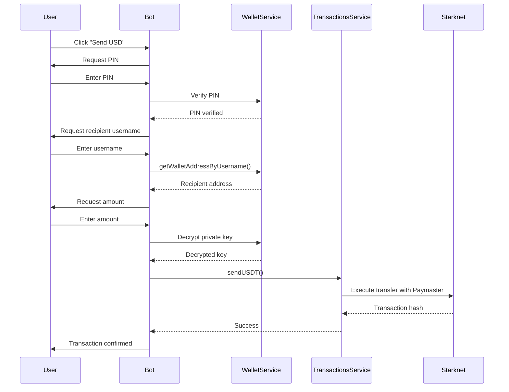
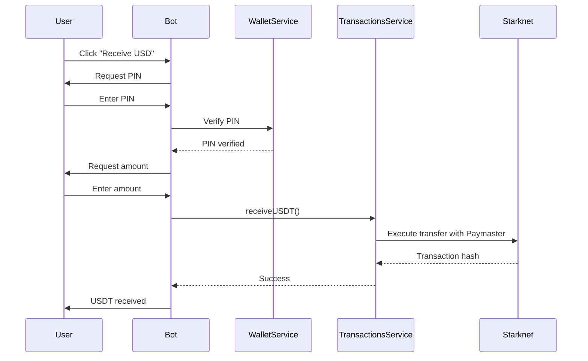

# Starkment Telegram Bot

A comprehensive Telegram bot built with NestJS that provides USDT wallet functionality on the Starknet blockchain. The bot enables users to create wallets, send/receive USDT, check balances, and manage transactions through an intuitive Telegram interface.

## 🏗️ Project Architecture

### System Overview

The Starkment Telegram Bot is built using a modular NestJS architecture with the following key components:



### Core Modules

#### 1. Bot Module (`src/bot/`)
- **Purpose**: Handles Telegram bot interactions and user sessions
- **Key Components**:
  - `UpdateService`: Main bot logic, command handlers, and user flow management
  - `MessageService`: Message processing utilities
  - `BotController`: HTTP endpoints for bot management
  - `BotService`: Core bot functionality

#### 2. Wallet Module (`src/wallet/`)
- **Purpose**: Manages user wallet creation, storage, and retrieval
- **Key Components**:
  - `WalletService`: Wallet creation using Starknet.js with Paymaster integration
  - `WalletSchema`: MongoDB schema for wallet data
  - `CreateWalletDto`: Data transfer object for wallet creation

#### 3. Transactions Module (`src/transactions/`)
- **Purpose**: Handles USDT transactions on Starknet
- **Key Components**:
  - `TransactionsService`: Send/receive USDT, balance checking, transaction history

#### 4. Common Module (`src/common/`)
- **Purpose**: Shared utilities and cryptographic functions
- **Key Components**:
  - `CryptoUtil`: AES-256-GCM encryption/decryption for private keys

## 🔄 User Flow Architecture

### Registration Flow



### Send USDT Flow



### Receive USDT Flow



## 📁 File Structure

```
starkment_telegram_bot/
├── src/                                    # Source code directory
│   ├── abis/                              # Smart contract ABIs
│   │   └── erc20_abi.json                 # ERC20 token ABI for USDT
│   ├── app.controller.ts                   # Main application controller
│   ├── app.module.ts                      # Root application module
│   ├── app.service.ts                     # Main application service
│   ├── main.ts                           # Application entry point
│   ├── bot/                              # Telegram bot module
│   │   ├── bot.controller.ts              # Bot HTTP controller
│   │   ├── bot.controller.spec.ts         # Bot controller tests
│   │   ├── bot.module.ts                  # Bot module configuration
│   │   ├── bot.service.ts                 # Core bot service
│   │   ├── bot.service.spec.ts            # Bot service tests
│   │   ├── message/                       # Message handling
│   │   │   ├── message.service.ts         # Message processing service
│   │   │   └── message.service.spec.ts    # Message service tests
│   │   └── update/                        # Update handling
│   │       ├── update.service.ts          # Main update handler (347 lines)
│   │       └── update.service.spec.ts     # Update service tests
│   ├── common/                           # Shared utilities
│   │   └── crypto.util.ts                 # AES-256-GCM encryption utilities
│   ├── transactions/                     # Transaction management
│   │   ├── transactions.module.ts         # Transactions module
│   │   ├── transactions.service.ts        # USDT transaction service (381 lines)
│   │   └── transactions.service.spec.ts   # Transaction service tests
│   └── wallet/                           # Wallet management
│       ├── dto/                          # Data Transfer Objects
│       │   └── create-wallet.dto.ts       # Wallet creation DTO
│       ├── schemas/                      # Database schemas
│       │   └── wallet.schema.ts          # MongoDB wallet schema
│       ├── erc20_abi.json               # ERC20 ABI (duplicate)
│       ├── wallet.module.ts              # Wallet module configuration
│       ├── wallet.service.ts             # Wallet service (230 lines)
│       └── wallet.service.spec.ts        # Wallet service tests
├── dist/                                 # Compiled JavaScript output
├── test/                                 # End-to-end tests
│   ├── app.e2e-spec.ts                   # E2E test suite
│   └── jest-e2e.json                     # E2E Jest configuration
├── node_modules/                         # Dependencies
├── package.json                          # Project dependencies and scripts
├── pnpm-lock.yaml                        # PNPM lock file
├── tsconfig.json                         # TypeScript configuration
├── tsconfig.build.json                   # Build-specific TypeScript config
├── nest-cli.json                         # NestJS CLI configuration
├── session.json                          # Telegram bot session storage
└── README.md                             # This file
```

## 🔧 Environment Configuration

Create a `.env` file in the root directory with the following configuration:

```env
# Application Configuration
HOST=127.0.0.1
PORT=3000
NODE_ENV=development

# Database Configuration
MONGO_URI=mongodb://localhost:27017/starkment_bot
USERS_WALLET_DETAILS_COLLECTION=user_wallets

# Telegram Bot Configuration
TELEGRAM_BOT_TOKEN=your_telegram_bot_token_here

# Starknet Configuration
RPC_URL=https://starknet-sepolia.public.blastapi.io
CONTRACT_ADDRESS=0x0773Ec0C0Bb16014f733888610c5c19123B6d5e3615Ea26208e7c90b0b5cddb2
CONTRACT_ENTRY_POINT_GET_COUNTER=get_counter
READY_CLASSHASH=0x05d23f18ff2a9a3c2c1a78efd19051b3625431a0ffdb57e38c2a4577a2a7e5d

# Paymaster Configuration
PAYMASTER_URL=https://sepolia.paymaster.avnu.fi
PAYMASTER_API_KEY=your_paymaster_api_key_here
PAYMASTER_MODE=sponsored
GAS_TOKEN_ADDRESS=0x049d36570d4e46f48e99674bd3fcc84644ddd6b96f7c7b7f8c8c8c8c8c8c8c8c

# Pool Account Configuration (for transaction execution)
ACCOUNT_ADDRESS_POOL=0x1234567899900abcdef1234567890abcdef12345678
PRIVATE_KEY_POOL=0x1234567890abcdef1234567890abcde00000f1234567890abcdef1234567890abcdef

# Security Configuration
ENCRYPTION_KEY=your_32_byte_hex_encryption_key_here_64_characters_long
```

### Environment Variables Explanation

#### Application Settings
- `HOST`: Server host address (default: 127.0.0.1)
- `PORT`: Server port (default: 3000)
- `NODE_ENV`: Environment mode (development/production)

#### Database Settings
- `MONGO_URI`: MongoDB connection string
- `USERS_WALLET_DETAILS_COLLECTION`: Collection name for user wallets

#### Telegram Bot Settings
- `TELEGRAM_BOT_TOKEN`: Bot token from @BotFather

#### Starknet Settings
- `RPC_URL`: Starknet RPC endpoint
- `CONTRACT_ADDRESS`: USDT contract address on Starknet
- `CONTRACT_ENTRY_POINT_GET_COUNTER`: Contract method for counter
- `READY_CLASSHASH`: Account class hash for wallet deployment

#### Paymaster Settings
- `PAYMASTER_URL`: Paymaster service URL
- `PAYMASTER_API_KEY`: API key for paymaster service
- `PAYMASTER_MODE`: Transaction fee mode (sponsored/default)
- `GAS_TOKEN_ADDRESS`: Gas token contract address

#### Pool Account Settings
- `ACCOUNT_ADDRESS_POOL`: Pool account address for transactions
- `PRIVATE_KEY_POOL`: Pool account private key

#### Security Settings
- `ENCRYPTION_KEY`: 32-byte hex key for AES-256-GCM encryption

## 🚀 Getting Started

### Prerequisites

- Node.js (v18 or higher)
- MongoDB
- PNPM package manager
- Telegram Bot Token
- Starknet RPC access
- Paymaster service access

### Installation

1. **Clone the repository**
   ```bash
   git clone <repository-url>
   cd starkment_telegram_bot
   ```

2. **Install dependencies**
   ```bash
   pnpm install
   ```

3. **Set up environment variables**
   ```bash
   cp .env.example .env
   # Edit .env with your configuration
   ```

4. **Start MongoDB**
   ```bash
   # Using Docker
   docker run -d -p 27017:27017 --name mongodb mongo:latest
   
   # Or using local MongoDB installation
   mongod
   ```

5. **Build the application**
   ```bash
   pnpm run build
   ```

6. **Start the application**
   ```bash
   # Development mode
   pnpm run start:dev
   
   # Production mode
   pnpm run start:prod
   ```

## 🛠️ Available Scripts

- `pnpm run build` - Compile TypeScript to JavaScript
- `pnpm run start` - Start the application
- `pnpm run start:dev` - Start in development mode with hot reload
- `pnpm run start:debug` - Start in debug mode
- `pnpm run start:prod` - Start in production mode
- `pnpm run lint` - Run ESLint
- `pnpm run test` - Run unit tests
- `pnpm run test:watch` - Run tests in watch mode
- `pnpm run test:cov` - Run tests with coverage
- `pnpm run test:e2e` - Run end-to-end tests

## 🔐 Security Features

### Private Key Encryption
- Private keys are encrypted using AES-256-GCM encryption
- Each wallet has a unique IV and authentication tag
- Encryption key is stored in environment variables

### PIN Protection
- 4-digit transaction PINs are hashed using bcrypt
- PIN verification required for all transactions
- Session management for secure user flows

### Input Validation
- Email format validation
- Amount validation (positive numbers only)
- Address format validation for Starknet addresses

## 🌐 API Endpoints

### Bot Endpoints
- `POST /bot/webhook` - Telegram webhook endpoint
- `GET /bot/health` - Bot health check

### Application Endpoints
- `GET /` - Application health check
- `GET /robots.txt` - Block search engine crawlers

## 📊 Database Schema

### Wallet Collection
```typescript
{
  userId: string;           // Telegram user ID
  username: string;         // Telegram username
  email: string;           // User email
  walletAddress: string;   // Starknet wallet address
  publicKey: string;       // Wallet public key
  privateKey: string;      // Encrypted private key
  iv: string;             // Encryption IV
  authTag: string;        // Encryption auth tag
  status: string;         // Wallet status
  gasToken: string;       // Gas token address
  mode: string;           // Paymaster mode
  success: boolean;       // Creation success flag
  transactionPin: string; // Hashed transaction PIN
  createdAt: Date;        // Creation timestamp
  updatedAt: Date;        // Last update timestamp
}
```

## 🔄 Transaction Flow

### Wallet Creation Process
1. Generate Starknet key pair
2. Deploy account contract using Paymaster
3. Encrypt private key with AES-256-GCM
4. Store wallet data in MongoDB
5. Return wallet address to user

### USDT Transfer Process
1. Verify user PIN
2. Decrypt private key
3. Create transfer transaction
4. Execute with Paymaster (gasless)
5. Return transaction hash

## 🧪 Testing

### Unit Tests
```bash
pnpm run test
```

### End-to-End Tests
```bash
pnpm run test:e2e
```

### Test Coverage
```bash
pnpm run test:cov
```

## 🚀 Deployment

### Docker Deployment
```dockerfile
FROM node:18-alpine
WORKDIR /app
COPY package*.json ./
RUN pnpm install
COPY . .
RUN pnpm run build
EXPOSE 3000
CMD ["pnpm", "run", "start:prod"]
```

### Environment Setup
1. Set up MongoDB cluster
2. Configure Starknet RPC endpoint
3. Set up Paymaster service
4. Configure environment variables
5. Deploy to your preferred platform

## 📝 Contributing

1. Fork the repository
2. Create a feature branch
3. Make your changes
4. Add tests for new functionality
5. Submit a pull request

## 📄 License

This project is licensed under the UNLICENSED license.

## 🆘 Support

For support and questions:
- Create an issue in the repository
- Contact the development team
- Check the documentation

## 🔮 Future Enhancements

- [ ] Multi-token support
- [ ] Advanced transaction history
- [ ] Wallet backup/restore
- [ ] Admin dashboard
- [ ] Mobile app integration
- [ ] Advanced security features
- [ ] Transaction notifications
- [ ] Fee estimation
- [ ] Batch transactions
- [ ] DeFi integrations

---

**Note**: This bot is designed for educational and development purposes. Ensure proper security measures and compliance with local regulations before using in production.